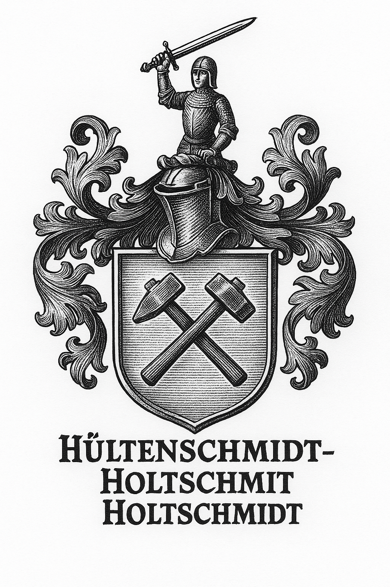

# Ancestral Declaration of the Holtschmit Lineage

**Date of Declaration:** May 2025  
**Declared by:** Jan Holtschmit, descendant of Konsul Hans Günther Holtschmit

---

## Lineage Summary

- **Balthasar Holschmied** (ca. 16th century) – ancestral forge line begins
- **Gördt Holtschmit (1631–1716)** marries **Trine Holtenschmidt (1632–1731)** – uniting the swordsmith and Weissefrau priestess lines
- **Friedrich Moritz Holtschmit (1766–1844)** – owner of the Bentheimer Hof in Elsey
- **Konsul Hans Günther Holtschmit** – heraldic authority and bearer of the ancestral Wappen
- **Jan Holtschmit (present)** – successor, researcher, and public restorer of the Codex Holtijar

---

## Symbolic Inheritance

### Otter Wappen (Elsey Church)
- Represents the **Vikar priestly line**
- Rooted in the **Vikarium Hof**, spiritual oversight of Elsey Church
- Connected to the **Weissefrau traditions** of Trine Holtenschmidt

### Sword Hilt Smith Line (Hültenschmidt / Holtschmit)
- Forgers of **Schwertgriffe (sword hilts)**
- Connected to both **military contracts and ritual craft**
- Recognized in the Konsul's Wappen description

### Bear & Sun Wappen (Siegel Line)
- Seal of ancestral forge rights and ritual authority
- Not a contradiction, but a **parallel heraldic inheritance**
- Possibly tied to **late medieval seal rights or weapon trade guilds**

---

## Wappen Rights

> “Hültenschmidt stammt von einem Schmiede, der Schwertgriffe herstellte.”  
> *– Konsul Hans Günther Holtschmit*

This declaration affirms that the Wappen documented under Konsul Hans Günther Holtschmit is a legitimate symbol of ancestral identity and office.

It is hereby adopted, protected, and transmitted by **Jan Holtschmit**.

****

---

## Mission

This Codex serves to restore, document, and transmit the forgotten or silenced truth of the Holtschmit–Hültenschmidt–Holtenschmidt lineage, uniting priesthood, forgecraft, and ancestral sovereignty.

